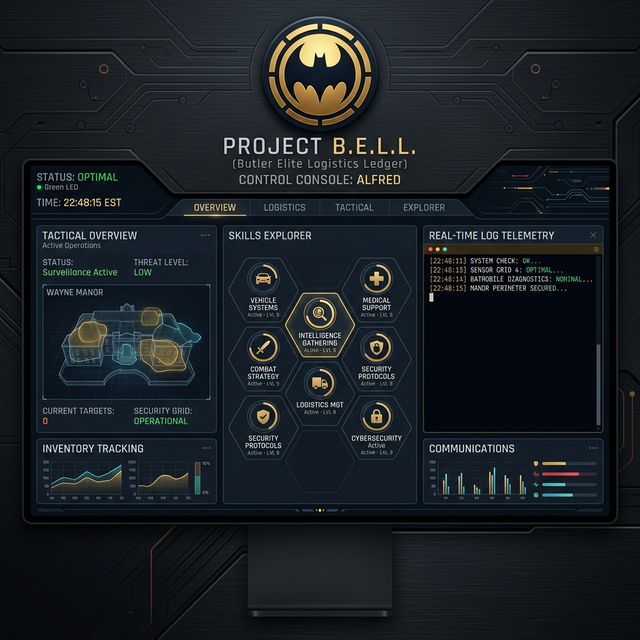
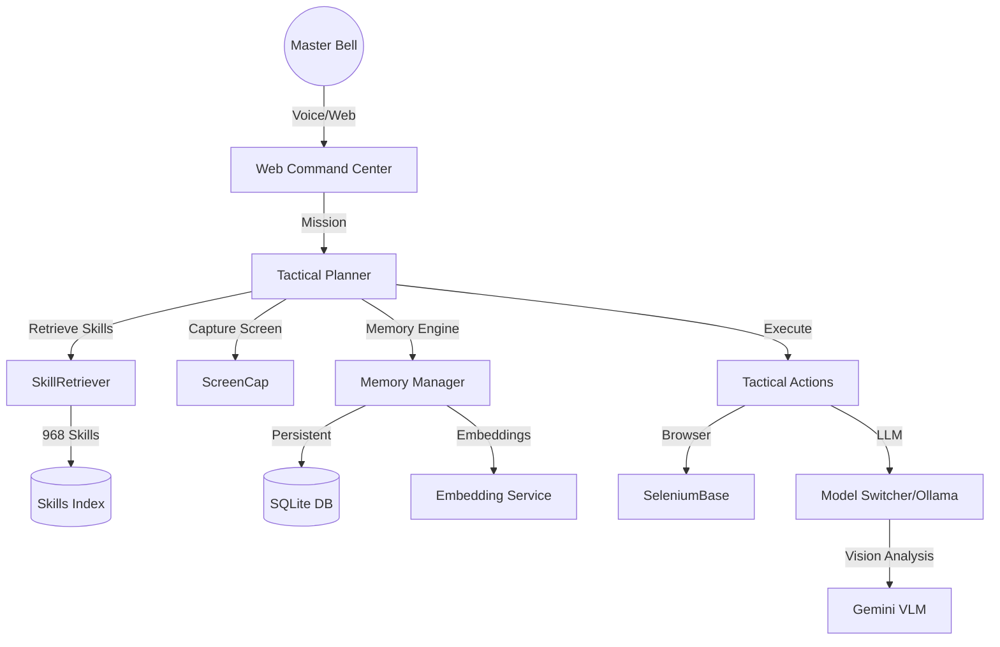

# 🦇 A.L.F.R.E.D. — PROJECT B.E.L.L

[](LICENSE)
[](https://www.python.org/)
[]()
[]()

**Autonomous Loyal Functional Robotic Electronic Dispatcher**



> "Master Bell, the Batcomputer is synced. All systems are at your disposal."

Alfred is a next-generation, Batman-inspired digital majordomo. Unlike traditional voice assistants, Alfred is designed for **autonomous mission execution**, featuring local RAG (Retrieval-Augmented Generation) expertise and a self-improving cognitive loop.

---

## 📖 Table of Contents

- [✨ Overview](#-overview)
- [⚔️ Core Capabilities](#️-core-capabilities)
- [🏗️ System Architecture](#️-system-architecture)
- [🚀 Installation](#-installation)
- [🛠️ Configuration](#️-configuration)
- [🏁 Usage](#-usage)
- [🗺️ Roadmap](#️-roadmap)
- [❓ Troubleshooting](#-troubleshooting)
- [📜 License](#-license)

---

## ✨ Overview

**Project B.E.L.L.** (Alfred) is a highly capable AI agent built for Windows utility, software development, and digital security. He operates with the dry wit and unwavering loyalty of Alfred Pennyworth, prioritizing Master Bell's efficiency above all else.

### Why Alfred?

- **Problem Statement**: Most AI assistants are static or "one-shot". Alfred is an **agentic loop** that can plan multi-step complex missions.
- **Comparison Matrix**:

  | Feature | Alfred (B.E.L.L.) | Jarvis (Legacy) | Home Assistant |
  | :--- | :--- | :--- | :--- |
  | **Identity** | Professional Majordomo | Generic Assistant | Automation Bridge |
  | **Cognition** | RAG + Self-Improvement | Static Prompts | Logic Gates |
  | **Execution** | Multi-step Planning | Simple Commands | Trigged Events |
  | **Theming** | Batman Tactical | Sci-Fi | Minimalist |

---

## ⚔️ Core Capabilities

- **Visual Intelligence**: Integrated VLM support (Gemini 1.5 Flash) for real-time screen analysis and understanding.
- **Multi-tier Persistent Memory**: Robust SQLite-backed memory system with semantic search capabilities (text-embedding-004).
- **RAG Intelligence Loop**: Dynamically retrieves expertise from an indexed arsenal of 968+ technical skills.
- **Batcave Tactical UI**: Premium dark/gold dashboard with real-time log telemetry.
- **Multi-Agent Orchestration**: Integrated with **CoPaw** for complex team-based operations.
- **Advanced Web Maneuvers**: **SeleniumBase** integration for bypassing bot detection and complex scraping.

---

## 🏗️ System Architecture




---

## 🚀 Installation

### Prerequisites

- **OS**: Windows 10/11 (Required for system controls)
- **Python**: 3.10 or higher
- **RAM**: 8GB Minimum (16GB Recommended for local LLMs)
- **API Keys**: Google Gemini API key (for primary LLM)

### Detailed Steps

1. **Clone the Repository**:

   ```bash
   git clone https://github.com/Karl/Alfred
   cd Alfred
   ```

2. **Setup Virtual Environment**:

   ```bash
   python -m venv venv
   .\venv\Scripts\activate
   ```

3. **Install Dependencies**:

   ```bash
   ./deploy.bat
   ```

   *Note: `deploy.bat` handles PyAudio, Playwright, and Skill indexing automatically.*

4. **API Key Configuration**:
   Create a `config/api_keys.json` file:

   ```json
   {
     "gemini": "YOUR_GEMINI_API_KEY",
     "ollama_url": "http://localhost:11434"
   }
   ```

---

## �️ Configuration

- **Voice Settings**: Modify `core/voice_engine.py` to adjust speech speed and pitch.
- **LLM Rotation**: Alfred rotates through `gemini-2.5-flash` and `flash-lite` to bypass free-tier limits. See `core/llm_manager.py`.
- **Identity**: Change user references in `ALFRED_PROTOCOLS.md`.

---

## 🏁 Usage

### Starting the System

```bash
python main.py
```

After launch, the **Web Command Center** will be available at `http://localhost:8000`.

### Sample Missions

- *"Alfred, analyze the logs and improve your web interaction protocol."*
- *"Alfred, research modern agentic patterns and save it to my desktop."*
- *"Alfred, monitor the Bat-Signal (Check my emails for urgent keywords)."*

---

## 🗺️ Roadmap

- [x] RAG Skill Retrieval
- [x] Self-Improvement Loop
- [ ] Multi-Agent Coordination (CoPaw Phase 2)
- [ ] Peripheral Vision (External Camera Support)
- [ ] Bat-Link (Mobile App Integration)

---

## ❓ Troubleshooting

- **PyAudio Error**: If `deploy.bat` fails to install PyAudio, please download the appropriate `.whl` from [Unofficial Windows Binaries](https://www.lfd.uci.edu/~gohlke/pythonlibs/#pyaudio).
- **LLM Timeout**: Ensure your internet connection is stable or that Ollama is running if in offline mode.

---

## 📜 License

Distributed under the **MIT License**. See `LICENSE` for more information.

---
*Engineered for The Mission. Respect the cowl.*
